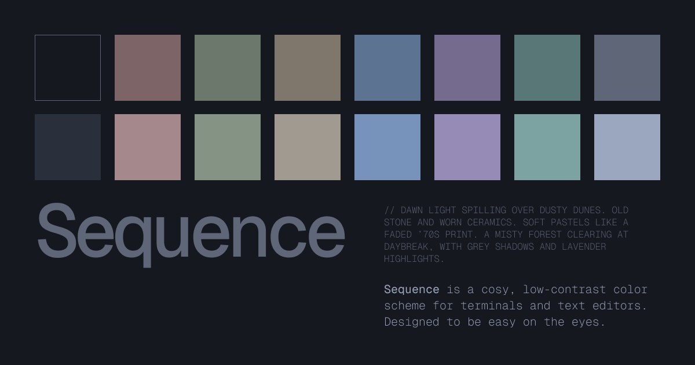
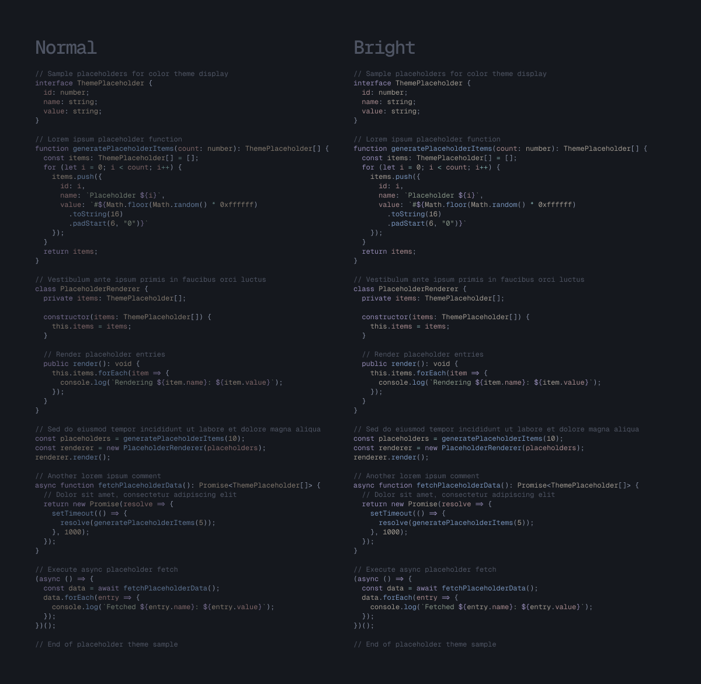
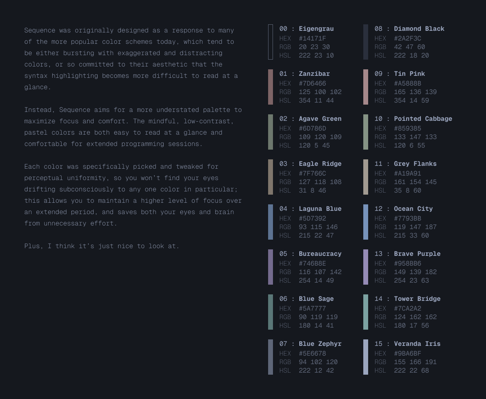

Sequence is a cosy, low-contrast color scheme for terminals and editors. Designed for calm focus, and to be easy on the eyes.

## Syntax Highlighting

### Terminals

- [Ghostty](https://github.com/jdsherrington/sequence/tree/main/ghostty)
- [Kitty](https://github.com/jdsherrington/sequence/tree/main/kitty)
- [Alacritty](https://github.com/jdsherrington/sequence/tree/main/alacritty)
- macOS Terminal - in progress
- Windows Terminal - in progress

### Editors

- Neovim - in progress
- Visual Studio Code - in progress

### Other

- pywal - in progress

## Colors

### Base

| Color | Hex       | RGB             |
| ----- | --------- | --------------- |
| 0     | `#14171F` | `20, 23, 30`    |
| 1     | `#7D6466` | `125, 100, 102` |
| 2     | `#6D786D` | `109, 120, 109` |
| 3     | `#7F766C` | `127, 118, 108` |
| 4     | `#5D7392` | `93, 115, 146`  |
| 5     | `#746B8E` | `116, 107, 142` |
| 6     | `#5A7777` | `90, 119, 119`  |
| 7     | `#5E6678` | `94, 102, 120`  |

### Bright

| Color | Hex       | RGB             |
| ----- | --------- | --------------- |
| 8     | `#2A2F3C` | `42, 47, 60`    |
| 9     | `#A5888B` | `165, 136, 139` |
| 10    | `#859385` | `133, 147, 133` |
| 11    | `#A19A91` | `161, 154, 145` |
| 12    | `#7793BB` | `119, 147, 187` |
| 13    | `#958BB6` | `149, 139, 182` |
| 14    | `#7CA2A2` | `124, 162, 162` |
| 15    | `#9BA6BF` | `155, 166, 191` |

## Contributing

Sequence is MIT licensed, so you're free to port Sequence to any app you'd like. If you do create a port for another app, please add a link to your port in the above list via pull request so that others can benefit from this.
