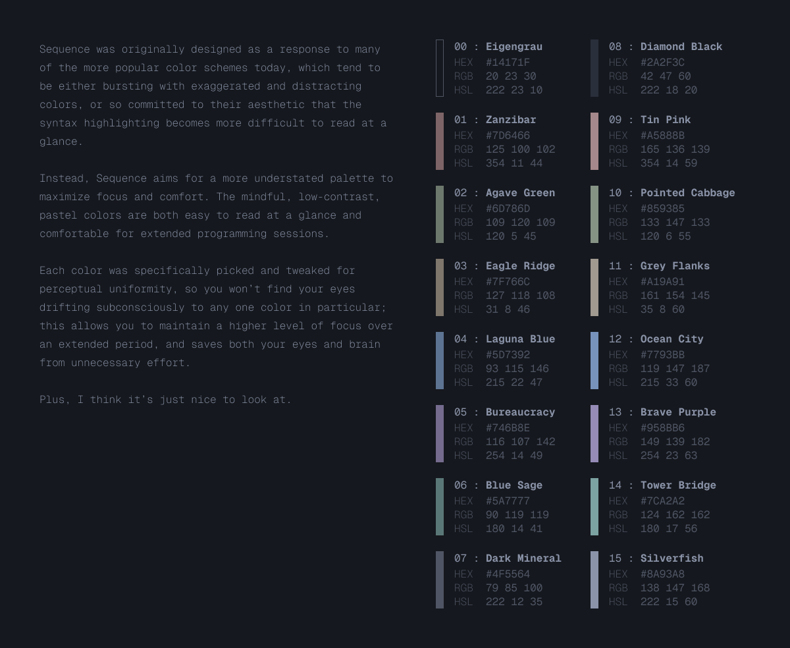

Sequence is a cosy, low-contrast color scheme for terminals and editors. Designed for calm focus, and to be easy on the eyes.

## Syntax Highlighting

### Terminals

- [Ghostty](https://github.com/jdsherrington/sequence/tree/main/ghostty)
- [Kitty](https://github.com/jdsherrington/sequence/tree/main/kitty)
- [Alacritty](https://github.com/jdsherrington/sequence/tree/main/alacritty)
- macOS Terminal - in progress
- Windows Terminal - in progress

### Editors

- [Neovim](https://github.com/jdsherrington/sequence/tree/main/nvim)
- [Visual Studio Code](https://github.com/jdsherrington/sequence/tree/main/vscode)

### Other

- [pywal](https://github.com/jdsherrington/sequence/tree/main/pywal)

## Colors

### Base

| Color | Hex       | RGB             | HSL           |
| ----- | --------- | --------------- | ------------- |
| 0     | `#14171F` | `20, 23, 30`    | `222. 23. 10` |
| 1     | `#7D6466` | `125, 100, 102` | `354, 11, 44` |
| 2     | `#6D786D` | `109, 120, 109` | `120, 5, 45`  |
| 3     | `#7F766C` | `127, 118, 108` | `31, 8, 46`   |
| 4     | `#5D7392` | `93, 115, 146`  | `215, 22, 47` |
| 5     | `#746B8E` | `116, 107, 142` | `254, 14, 49` |
| 6     | `#5A7777` | `90, 119, 119`  | `180, 14, 41` |
| 7     | `#4F5564` | `79, 85, 100`   | `222, 12, 35` |

### Bright

| Color | Hex       | RGB             | HSL             |
| ----- | --------- | --------------- | --------------- |
| 8     | `#2A2F3C` | `42, 47, 60`    | `222, 18, 20`   |
| 9     | `#A5888B` | `165, 136, 139` | `354, 14, 59`   |
| 10    | `#859385` | `133, 147, 133` | `120, 6, 55`    |
| 11    | `#A19A91` | `161, 154, 145` | `161, 154, 145` |
| 12    | `#7793BB` | `119, 147, 187` | `215, 33, 60`   |
| 13    | `#958BB6` | `149, 139, 182` | `254, 23, 63`   |
| 14    | `#7CA2A2` | `124, 162, 162` | `180, 17, 56`   |
| 15    | `#8A93A8` | `138, 147, 168` | `222, 15, 60`   |

## Contributing

Sequence is MIT licensed, so you're free to port Sequence to any app you'd like. If you do create a port for another app, please add a link to your port in the above list via pull request so that others can benefit from this.
